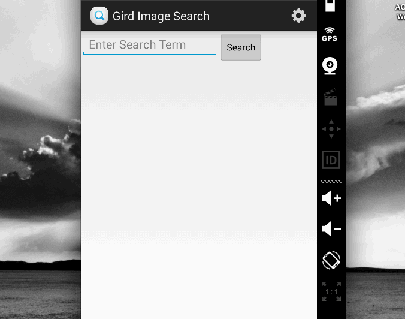

GirdImageSearch
===============
Time spent: 14 hours spent in total

Completed user stories:

Required:User can enter a search query that will display a grid of image results from the Google Image API. 
Required:User can click on "settings" which allows selection of advanced search options to filter results
Required:User can configure advanced search filters and be persistent across app sessions
Required:Subsequent searches will have any filters applied to the search results
Required:User can tap on any image in results to see the image full-screen
Required:User can scroll down “infinitely” to continue loading more image results (up to 8 pages)

Notes:

Spent some time learning infinte scroll and how Adapters work in listview and Gridview.

Walkthrough of all user stories:

